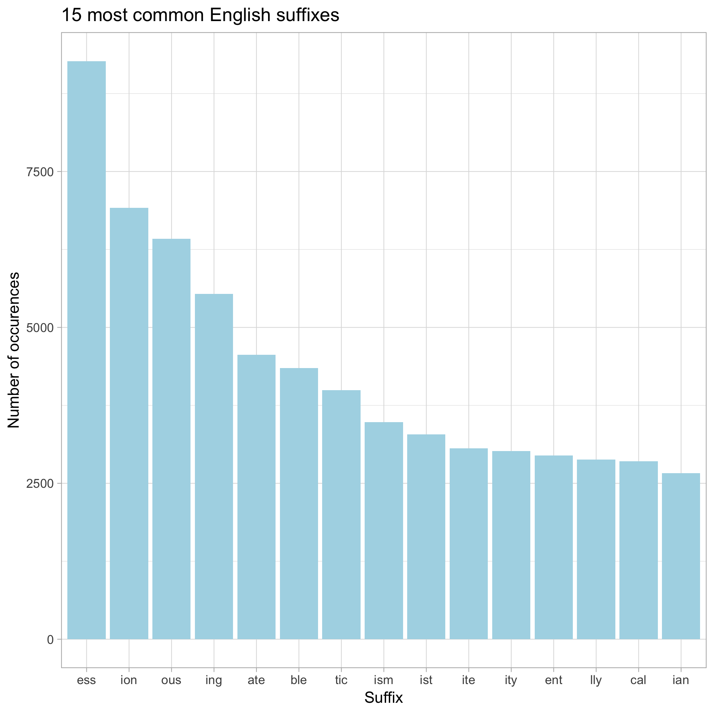

```{r load-suffix-dat, include = FALSE}
 suffix_dat <- read.delim("suffix.tsv")
```

I used the dictionary of English words availabe on my computer at `/usr/share/dict/words` to calculate the most commonly used word suffixes. 
 
I started off by selecting only the last three letters of each word, and then counting how many times these suffixes occured. 


Turns out "`r with(suffix_dat, value[which.max(n)])`" is the most commonly used suffix in English! 

Check out my results below. 

